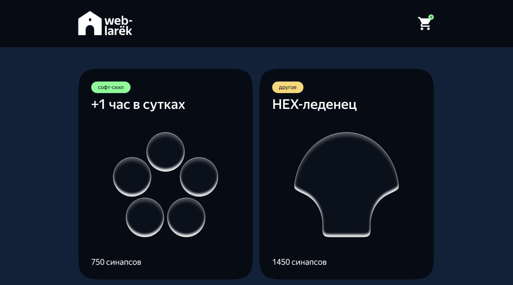

# Проектная работа "Веб-ларек"



---

Макет: <https://www.figma.com/design/50YEgxY8IYDYj7UQu7yChb/%D0%92%D0%B5%D0%B1-%D0%BB%D0%B0%D1%80%D1%91%D0%BA?node-id=0-1&p=f&t=pBqYyzPppMA2tvCl-0>

---

## Функциональность

🛍️ Просмотр карточки товара  
🛒 Добавление товара в корзину  
👁️ Просмотр корзины  
🗑️ Удаление товара из корзины
🧾 Оформление заказа

## Стек

<div>
  
  
  
  
</div>

## Структура проекта

```text
src/                — исходные файлы проекта
├── common.blocks/  — папка со стилями компонентов
├── components/     — папка с JS компонентами
│  ├── api/         — webLarekApi
│  ├── base/        — api, baseView, events, form
│  ├── model/       — cart, catalog, contacts, order
│  └── view/        — cart, cartCounter, catalog и др.
├── images/         — папка с картинками и иконками
├── pages/
│   └── index.html  — HTML-файл главной страницы
├── scss/           — Стили
│  └── styles.scss  — корневой файл стилей
├── types/          — папка с типами
│  ├── common.ts
│  ├── event.ts     — файл с типами событий
│  ├── model.ts
│  ├── view.ts
│  └── WebLarekApi.ts
├── utils/
│  ├── constants.ts — файл с константами
│  └── utils.ts     — файл с утилитами
├── vendor/         — сторонний код
└── index.ts        — точка входа приложения
```

## Установка и запуск

Для установки и запуска проекта необходимо выполнить команды

```bash
npm install
npm run start
```

или

```bash
yarn
yarn start
```

## Сборка

```bash
npm run build
```

или

```bash
yarn build
```

---

## Архитектура приложения

Приложение построено на основе паттерна MVP (Model-View-Presenter)

---

## Базовые классы

### `EventEmitter`

Класс `EventEmitter` обеспечивает работу событий.

Функции:

- возможность установить и снять слушатели событий
- вызвать слушатели при возникновении события

Методы:

- `on<T extends object>(eventName: EventName, callback: (event: T) => void)` - устанавливает обработчик `callback` на событие `eventName`

- `off(eventName: EventName, callback: Subscriber)` - снимает обработчик `callback` с события `eventName`

- `emit<T extends object>(eventName: string, data?: T)` - инициирует событие `eventName` с опциональными данными `data`

- `onAll(callback: (event: EmitterEvent) => void)` - устанавливает обработчик `callback` на на все события

- `offAll()` - сбрасывает все обработчики

- `trigger<T extends object>(eventName: string, context?: Partial<T>)` - создаёт коллбек-триггер, генерирующий событие `eventName` при вызове

---

### `Api`

Класс `Api` обеспечивает взаимодействие с сервером.

Конструктор:

`constructor(baseUrl: string, options: RequestInit = {})` - принимает на вход базовый URL сервера и объект опций для всех запросов.

Методы:

- `protected handleResponse(response: Response): Promise<object>` - возвращает json с данными ответа в случае успешного запроса, иначе отклоняет запрос с ошибкой

- `get(uri: string)` - получение данных через методом GET

- `post(uri: string, data: object, method: ApiPostMethods = 'POST'` - отправка данных методом POST

---

### `BaseView<DataType>`

Абстрактный Класс `BaseView` реализует базовый контракт для классов отображений.

Дженерик `<DataType>` - тип данных получаемых в методе `render`.

Конструктор:

`constructor(protected element: HTMLElement, protected events?: IEvents)` - принимает на вход HTMLElement и опциональный параметр - объект событий.

Методы:

- `render(data: Partial<DataType>): HTMLElement` - возвращает HTML элемент, устанавливая переданные данные как поля класса

- `protected showElement(element: HTMLElement)` - удаляет атрибут `hidden` у элемента, переданного в аргументе

- `protected hideElement(element: HTMLElement)` - устанавливает атрибут `hidden` в значении `true` у элемента, переданного в аргументе

- `protected _isDisabled(element: HTMLElement): boolean` - возвращает `true`, если у элемента установлен атрибут `disabled`

- `protected disableElement(element: HTMLElement)` - устанавливает атрибут `disabled` в значении `true` у элемента, переданного в аргументе

- `protected enableElement(element: HTMLElement)` - удаляет атрибут `disabled` у элемента, переданного в аргументе

- `protected setIsDisabled(element: HTMLElement, disabled: boolean)` - удаляет или устанавливает атрибут `disabled` у элемента, переданного в аргументе

- `protected setText(element: HTMLElement, value: unknown)` - задаёт значение в textContent

- `protected setImage(element: HTMLImageElement, src: string, alt?: string)` - устанавливает src и alt элементу `img`, переданному аргументом

- `protected setInputValue(element: HTMLInputElement, value: HTMLInputElement['value'])` - устанавливает переданное значение в `value` элемента `input`

- `protected setElementAttribute(element: HTMLElement, attributeName: string, attributeValue: AttributeValue)` - удаляет или устанавливает переданный атрибут элементу

---

### `Form`

`class Form<DataType extends { inputValues: Record<string, string> }>`

Дженерик `<DataType extends { inputValues: Record<string, string>>` - тип данных получаемых в методе `render`.

Конструктор:

`constructor(protected element: HTMLElement, protected events?: IEvents)` - базовый конструктор `BaseView`, принимает на вход HTMLElement и опциональный параметр - объект событий.

Поля:

- `protected _formInputs: NodeListOf<HTMLInputElement>` - список элементов `input`

- `protected _submitBtn` - элемент кнопки сабмита

- `protected _errors` - элемент-контейнер для текста ошибок

Методы:

- `set inputValues(values: DataType['inputValues'])` - устанавливает переданные значения в инпуты

- `set errors(value: string)` - устанавливает переданное значение в элемент ошибки

- `setIsDisabledSubmitBtn(disabled: boolean)` - устанавливает или снимает состояние `disabled` у кнопки сабмита

---

## API

### `WebLarekApi`

Класс для для взаимодействия с сервером `weblarek`.
Наследуется от класса `Api`, реализует интерфейс `IWebLarekApi`.

Конструктор:

`constructor({ options = {}, cdn }: { options?: RequestInit; cdn: string })` - принимает объект с опциональным объектом опций `options` и строкой базового адреса для получения изображений `cdn`

Поля:

- `private _cdn: string` - хранит базовый адрес для получения изображений

Методы:

- `protected _prepareProduct(product: Product): Product` - метод, принимающий объект с данными о продукте и добавляющий ему поле image со ссылкой на адрес хранения изображения

- `getProductById(id: Product['id'])` - возвращает продукт по его идентификатору.

- `getProductList()` - возвращает список всех продуктов.

- `createOrder(order: CreateOrderRequest)` - принимает аргументом объект заказа и создает новый заказ на основе переданных данных.

---

## Модели

Модель отвечает за управление данными приложения и бизнес-логикой, хранит актуальное состояние, сообщает об изменениях в данных.

---

### `CatalogModel`

управляет списком продуктов, реализует интерфейс `ICatalogModel`

Конструктор:

- `constructor(protected events: IEvents) {}` - сохраняет объект событий

Поля:

- `protected _items: Product[]` - хранит список всех продуктов

Методы:

- `setItems(items: Product[])` - принимает список продуктов и сохраняет его

- `getProduct(id: ProductId): Product` -возвращает продукт по его идентификатору

- `#changed()` - создаёт событие `catalog:change`, уведомляющее об изменении состояния модели.

---

### `CartModel`

управляет состоянием корзины, реализует интерфейс `ICartModel`

Конструктор:

- `constructor(protected events: IEvents) {}` - сохраняет объект событий

Поля:

- `protected _items: Map<ProductId, number> = new Map();` - хранит данные о добавленных продуктах в корзину

- `protected _totalPrice = 0` - хранит общую стоимость товаров в корзине

- `protected _itemsCount = 0` - хранит общее количество товаров, добавленных в корзину

Методы:

- `get totalPrice(): number` - возвращает общую стоимость товаров в корзине

- `get itemsCount(): number` - возвращает общее количество товаров, добавленных в корзину

- `get itemsIds(): ProductId[]` - возвращает массив `id` продуктов, добавленных в корзину

- `isItemInCart(id: ProductId): boolean` - проверяет, добавлен ли товар в корзину

- `add(id: ProductId, price: number)` - добавляет продукт в корзину

- `remove(id: ProductId, price: number)` - удаляет продукт из корзины

- `reset()` - очищает корзину

- `#changed()` - создаёт событие `cart:change`, уведомляющее об изменении состояния модели.

---

### `ContactsModel`

управляет состоянием контактов, реализует интерфейс `IContactsModel`

Конструктор:

- `constructor(protected events: IEvents) {}` - сохраняет объект событий

Поля:

- `_contacts: Contacts` - хранит данные `email` и `phone`

Методы:

- `set contacts(details: Partial<Contacts>)` - обновляет значения в поле `_contacts`

- `get contacts(): Contacts` - возвращает данные поля `_contacts`

- `get errorMessage(): string` - возвращает текст ошибки, если данные в `_contacts` невалидны

- `get isValidContacts(): boolean` - возвращает `true`, если данные в `_contacts` валидны, иначе `false`

- `get isValidateEmail(): boolean` - возвращает `true`, если `email` валиден, иначе `false`

- `get isValidPhone(): boolean` - возвращает `true`, если `phone` валиден, иначе `false`

- `reset()` - очищает данные `_contacts`

- `#changed()` - создаёт событие `contacts:change`, уведомляющее об изменении состояния модели.

---

### `OrderModel`

управляет состоянием заказа, реализует интерфейс `IOrderModel`

Конструктор:

- `constructor(protected events: IEvents) {}` - сохраняет объект событий

Поля:

- `protected _orderDetails: Order` - ранит данные `address` и `payment`

Методы:

- `set orderDetails(details: Partial<Order>)` - обновляет значения в поле `_orderDetails`

- `get orderDetails(): Order` - возвращает данные поля `_orderDetails`

- `get isValidOrder(): boolean` - возвращает `true`, если данные в `_orderDetails` валидны, иначе `false`

- `get errorMessage(): string` - возвращает текст ошибки, если данные в `_orderDetails` невалидны

- `reset()` - очищает данные `_orderDetails`

- `#changed()` - создаёт событие `order:change`, уведомляющее об изменении состояния модели.

---

## Представление

Представления отвечают за отображение данных пользователю. Ничего не знают про бизнес-логику, сообщают о действиях пользователя.

---

### `MainPageView`

`class MainPage extends BaseView<IMainPageData> implements IMainPage`

отвечает за отображение главной страницы, наследуется от базового класса `BaseView`, реализует интерфейс `IMainPage`

Конструктор:

- `constructor(element: HTMLElement)` - принимает контейнер отображения в параметре `element`

Поля:

- `protected _pageWrapper: HTMLElement` - элемент обёртки страницы, меняющий своё состояние при открытии модального окна

Методы:

- `set isLocked(value: boolean)` - управляет состоянием прокрутки главной страницы

---

### `PopupView`

`class PopupView extends BaseView<IPopupViewData> implements IPopupView`

отвечает за отображение модальных окон, наследуется от базового класса `BaseView`, реализует интерфейс `IPopupView`

Конструктор:

- `constructor(element: HTMLElement, events: IEvents)` - принимает контейнер отображения в параметре `element` и объект событий `events`

Поля:

- `protected _closeBtn: HTMLButtonElement` - элемент кнопки закрытия модального окна

- `protected _modalContent: HTMLElement` - контейнер для представления, которое будет отображаться внутри модального окна.

- `` -

Методы:

- `set content(value: HTMLElement)` - добавляет контент в элемент, хранящийся в `_modalContent`

- `protected _handleEscClose(evt: KeyboardEvent)` - закрывает модальное окно при нажатии клавиши `Escape`

- `protected _handleOverlayClose(evt: MouseEvent)` - закрывает модальное окно при клике на оверлей

- `protected _setListeners()` - устанавливает слушатели событий для закрытия модального окна

- `protected _removeListeners()` - очищает слушатели событий

- `open()` - открывает модальное окно, устанавливает слушатели, сообщает о событии `modal:open`

- `close()` - закрывает модальное окно, снимает слушатели, сообщает о событии `modal:close`

---

### `ProductView<DataType>`

`class ProductView<DataType> extends BaseView<DataType> implements IProductView`

отвечает за отображение продукта, наследуется от базового класса `BaseView`, реализует интерфейс `IProductView`

Дженерик `<DataType>` - тип данных продукта

Конструктор:

- `constructor(element: HTMLElement, events: IEvents)` - принимает контейнер отображения в параметре `element` и объект событий `events`

Поля:

- `protected _cardImage: HTMLImageElement` - элемент с картинкой товара

- `protected _cardCategory: HTMLElement` - элемент для отображения категории товара

- `protected _cardTitle: HTMLElement` - элемент для отображения названия товара

- `protected _cardPrice: HTMLElement` - элемент для отображения стоимости товара

- `protected _cardText: HTMLElement` - элемент для отображения описания товара

- `protected _actionBtn: HTMLButtonElement` - элемент кнопки действия с товаром

- `protected _id: string` - id товара

Методы:

- `protected _getPriceText(price: number | null): string` - на основании стоиомсти товара возвращает текст для отображения

- `set id(value: ProductId)` - устанавливает значение в поле `_id`

- `set image(src: string)` - добавляет ссылку для отображения картинки товара в элемент `_cardImage`

- `set title(value: string)` - добавляет название товара в элемент `_cardTitle` и описание картинки в элемент `_cardImage`

- `set category(value: string)` - добавляет категорию товара и её цвет в элемент `_cardCategory`

- `set description(value: string)` - добавляет описание товара в элемент `_cardText`

- `set price(value: number)` - добавляет стоимость товара в элемент `_cardPrice`

---

### `ProductCartView`

`class ProductCartView extends ProductView<CartProduct> implements IProductCartView`

отвечает за отображение продукта в корзине, наследуется от класса `ProductView`, реализует интерфейс `IProductCartView`

Конструктор:

- `constructor(element: HTMLElement, events: IEvents)` - принимает контейнер отображения в параметре `element` и объект событий `events`

Поля:

- `protected _productIndex: HTMLElement` - элемент для отображения порядкового номера товара в корзине

Методы:

- `set productIndex(value: number)` - добавляет номер товара в элемент `_productIndex`

---

### `ProductGalleryView`

`class ProductGalleryView extends ProductView<Product>`

отвечает за отображение продукта в галерее на главной странице, наследуется от класса `ProductView`

Конструктор:

- `constructor(element: HTMLElement, events: IEvents)` - принимает контейнер отображения в параметре `element` и объект событий `events`

---

### `ProductPreviewView`

`class ProductPreview extends ProductView<Product> implements IProductPreview`

отвечает за отображение полной информации о продукте, наследуется от класса `ProductView`, реализует интерфейс `IProductPreview`

Конструктор:

- `constructor(element: HTMLElement, events: IEvents)` - принимает контейнер отображения в параметре `element` и объект событий `events`

Методы:

- `set price(value: number)` - расширяет родительский `set price`, добавляя дизейбл ддя кнопки действия с товаром в случае отсутствия стоимости

- `setIsDisabledAddBtn(disabled: boolean)` - добавляет дизейбл ддя кнопки действия с товаром

---

### `CatalogView`

`class CatalogView extends BaseView<Product[] implements ICatalogView`

отвечает за отображение каталога продуктов, наследуется от базового класса `BaseView`, реализует интерфейс `ICatalogView`

Конструктор:

- `constructor(element: HTMLElement, events: IEvents)` - принимает контейнер отображения в параметре `element`

Методы:

- `updateContent(elements: HTMLElement[])` - обновляет отображение списка продуктов

---

### `CartCounter`

`class CartCounter extends BaseView<ICartCounterData> implements ICartCounter`

отвечает за отображение счётчика количества товаров в корзине, наследуется от базового класса `BaseView`, реализует интерфейс `ICartCounter`

Конструктор:

- `constructor(element: HTMLElement, events: IEvents)` - принимает контейнер отображения в параметре `element` и объект событий `events`

Поля:

- `protected _countContainer: HTMLElement;` - элемент отображения количества товаров в корзине

Методы:

- `set count(value: number)` - добавляет количество товаров в корзине в элемент `_countContainer`

---

### `CartView`

`class CartView extends BaseView<ICartViewData> implements ICartView`

отвечает за отображение корзины, наследуется от базового класса `BaseView`, реализует интерфейс `ICartView`

Конструктор:

- `constructor(element: HTMLElement, events: IEvents)` - принимает контейнер отображения в параметре `element` и объект событий `events`

Поля:

- `protected _cartListElement: HTMLUListElement` - элемент для отображения списка товаров, добавленных в корзину

- `protected _totalPriceElement: HTMLElement` - элемент для отображения общей стоимости товаров, добавленных в корзину

- `protected _actionBtn: HTMLButtonElement` - элемент кнопки действия с корзиной (перехода к оформлению заказа)

Методы:

- `protected _getPriceText(price: number | null): string` - возвращает текст со стоимостью товаров или пустую строку, если в корзине нет товаров

- `set cartItems(elements: HTMLElement[])` - отображает добавленные товары или сообщает, что корзина пуста

- `set totalPrice(value: number)` - отображает общую стоимость товаров в корзине

- `setIsDisabledOrderBtn(disabled: boolean)` - управляет состоянием `disabled` кнопки действия с корзиной

---

### `OrderFormView`

`class OrderFormView extends Form<IOrderFormViewData> implements IOrderFormView`

отвечает за отображение формы заказа, наследуется от класса `Form`, реализует интерфейс `IOrderFormView`

Конструктор:

- `constructor(element: HTMLFormElement, events: IEvents)` - принимает контейнер отображения в параметре `element` и объект событий `events`

Поля:

- `protected _paymentBtns: NodeListOf<HTMLButtonElement>;` - список элементов кнопок с доступными типами оплаты

Методы:

- `set payment(value: PaymentType)` - добавляет или убирает активный класс для элементов в `_paymentBtns`

---

### `ContactsFormView`

`class ContactsFormView extends Form<IContactsFormViewData>`

отвечает за отображение формы контактов, наследуется от класса `Form`

Конструктор:

- `constructor(element: HTMLFormElement, events: IEvents)` - принимает контейнер отображения в параметре `element` и объект событий `events`

---

### `SuccessView`

`class  SuccessView extends BaseView<ISuccessData> implements ISuccess`

отвечает за отображение уведомления об успешном заказе, наследуется от базового класса `BaseView`, реализует интерфейс `ISuccess`

Конструктор:

- `constructor(element: HTMLElement, events: IEvents)` - принимает контейнер отображения в параметре `element` и объект событий `events`

Поля:

- `protected _title: HTMLElement` - элемент для отображения заголовка сообщения

- `protected _description: HTMLElemen` - элемент для отображения описания сообщения

- `protected _closeBtn: HTMLButtonElement` - элемент кнопки завершения заказа

Методы:

- `set totalPrice(value: number)` - добавляет описание в элемент `_description`

---

## Презентер

Презентер связывает модель и представление на основе брокера событий. Он отвечает за обработку пользовательского ввода, обновление модели и обновление представления на основе изменений в модели.

---

## События

`cart:remove` - удаление товара из корзины
`cart:add` - добавление товара в корзину
`cart:change` - изменение в модели корзины
`cart:open` - открытие корзины

`catalog:change` - изменение в модели каталога товаров

`product:get-details` - получение подробной информации о товаре

`modal:open` - открытие модального окна
`modal:close` - закрытие модального окна

`order:create` - создание заказа
`order:change` - изменение в модели заказа
`order:setValue` - сохранение пользовательского ввода данных в модель заказа
`order:submit` - подтверждение деталей заказа
`order:finish` - завершение заказа

`contacts:change` - изменение в модели контактов пользователя
`contacts:setValue` - сохранение пользовательского ввода данных в модель контактов
`contacts:submit` - подтверждение введённых контактных данных

## Типы и интерфейсы

### Базовые типы

```typescript
export type ProductId = string;

export type PaymentType = 'card' | 'cash';

export type Contacts = {
  phone: string;
  email: string;
};

export type Product = {
  id: ProductId;
  description: string;
  image: string;
  title: string;
  category: string;
  price: number | null;
};

export type CartProduct = Product & {
  productIndex: number;
};

export type Order = {
  payment: PaymentType;
  address: string;
};
```

### Типы моделей

```typescript
export interface ICatalogModel {
  setItems(items: Product[]): void;
  getProduct(id: ProductId): Product;
}

export interface ICartModel {
  add(id: ProductId, price: number): void;
  remove(id: ProductId, price: number): void;
  isItemInCart(id: ProductId): boolean;
  reset(): void;
}

export interface IUserModel {
  address: string;
  contacts: Contacts;
}

export interface IContactsModel {
  contacts: Contacts;
  errorMessage: string;
  isValidContacts: boolean;
  isValidPhone: boolean;
  isValidateEmail: boolean;
  reset(): void;
}

export interface IOrderModel {
  orderDetails: Order;
  isValidOrder: boolean;
  errorMessage: string;
  reset(): void;
}
```

### Типы отображений

```typescript
export interface IView<DataType> {
  render(data?: DataType): HTMLElement;
}

export interface IMainPage {
  isLocked: boolean;
}

export interface IMainPageData {
  isLocked: boolean;
}

export interface ICatalogView {
  updateContent(elements: HTMLElement[]): void;
}

export interface IProductView {
  id: ProductId;
  image: string;
  title: string;
  category: string;
  description: string;
  price: number;
}

export interface IProductCartView {
  productIndex: number;
}

export interface IProductPreview {
  setIsDisabledAddBtn(disabled: boolean): void;
}

export interface IPopupView {
  content: HTMLElement;
  open(): void;
  close(): void;
}

export interface IPopupViewData {
  content: HTMLElement;
}

export interface IForm<
  DataType extends { inputValues: Record<string, string> }
> {
  inputValues: DataType['inputValues'];
  errors: string;
  setIsDisabledSubmitBtn(disabled: boolean): void;
}

export interface IFormData<DataType> {
  inputValues: DataType;
}

export interface IOrderFormView {
  payment: PaymentType;
}

export interface IOrderFormViewData extends IFormData<Pick<Order, 'address'>> {
  payment: PaymentType;
}

export interface IContactsFormViewData extends IFormData<Contacts> {
  inputValues: Contacts;
}

export interface ICartCounter {
  count: number;
}

export interface ICartCounterData {
  count: number;
}

export interface ICartView extends ICartViewData {
  setIsDisabledOrderBtn(disabled: boolean): void;
}

export interface ICartViewData {
  cartItems: HTMLElement[];
  totalPrice: number;
}

export interface ISuccess {
  totalPrice: number;
}

export interface ISuccessData {
  totalPrice: number;
}
```

### Типы апи

```typescript
export type CreateOrderRequest = {
  payment: PaymentType;
  email: string;
  phone: string;
  address: string;
  total: number;
  items: ProductId[];
};

export type CreateOrderResponse = {
  id: string;
  total: number;
};

export interface IWebLarekApi {
  getProductById: (id: Product['id']) => Promise<Product>;
  getProductList: () => Promise<Product[]>;
  createOrder: (order: CreateOrderRequest) => Promise<CreateOrderResponse>;
}
```
