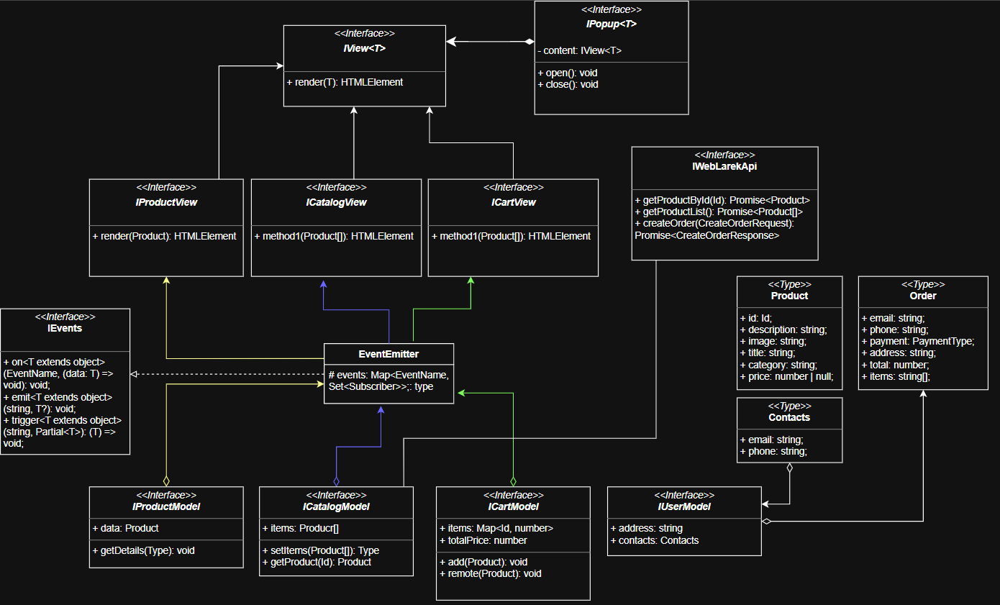

# Проектная работа "Веб-ларек"


---

Макет: <https://www.figma.com/design/50YEgxY8IYDYj7UQu7yChb/%D0%92%D0%B5%D0%B1-%D0%BB%D0%B0%D1%80%D1%91%D0%BA?node-id=0-1&p=f&t=pBqYyzPppMA2tvCl-0>

---

## Функциональность

🛍️ Просмотр карточки товара  
🛒 Добавление товара в корзину  
👁️ Просмотр корзины  
🧾 Оформление заказа

---

## Стек

<div>
  
  
  
  
</div>

---

## Структура проекта

- src/ — исходные файлы проекта
- src/components/ — папка с JS компонентами
- src/components/base/ — папка с базовым кодом
- src/types/ — папка с типами

## Важные файлы

- src/pages/index.html — HTML-файл главной страницы
- src/index.ts — точка входа приложения
- src/scss/styles.scss — корневой файл стилей
- src/utils/constants.ts — файл с константами
- src/utils/utils.ts — файл с утилитами

## Установка и запуск

Для установки и запуска проекта необходимо выполнить команды

```bash
npm install
npm run start
```

или

```bash
yarn
yarn start
```

## Сборка

```bash
npm run build
```

или

```bash
yarn build
```

---

## Архитектура приложения

Приложение построено на основе паттерна MVP (Model-View-Presenter)

## Базовые классы

- Класс `EventEmitter` обеспечивает работу событий.\
  Функции:

  - возможность установить и снять слушателей событий
  - вызвать слушателей при возникновении события

- Класс `Api` обеспечивает работу с апи .\
  Принимает на вход базовый URL и объект опций запроса.  
  Функции:

  - получение данных через https методом GET
  - отправка данных через https методом POST

- Абстрактный Класс `View` реализует базовый контракт для классов отображений.\
  Принимает на вход HTMLElement и опциональный параметр - объект событий.  
  Функции:
  - рендер отображения

## API

Для взаимодействия с сервером используется интерфейс `IWebLarekApi`, который предоставляет следующие методы:

- `getProductById(id: Product['id'])`: получает продукт по его идентификатору.

- `getProductList()`: получает список всех продуктов.

- `createOrder(order: Order)`: создает новый заказ на основе переданных данных.

## Модели

Модель отвечает за управление данными приложения и бизнес-логикой.

- `IProductModel`: управляет отдельным продуктом, предоставляет методы:

  - `getDetails()` для получения подробной информации о продукте.

- `ICatalogModel`: управляет списком продуктов, предоставляет методы:

  - `setItems(items: Product[])` для установки списка продуктов
  - `getProduct(id: Id)` для получения конкретного продукта по его идентификатору.

- `ICartModel`: управляет корзиной покупок, предоставляет методы:

  - `add(item: Product)` для добавления продукта в корзину,
  - `remove(item: Product)` для удаления продукта

  Данная Модель хранит общую стоимость корзины.

- `IUserModel`: хранит информацию о пользователе, включая адрес и контактные данные.

## Представление

Представление отвечает за отображение данных пользователю. Оно включает в себя следующие интерфейсы:

- `IView<T>`: базовый интерфейс для всех представлений, который имеет метод `render(data?: T): HTMLElement` для отображения данных.

- `IPopupView<T>` предназначен для управления всплывающими окнами в приложении. Он расширяет функциональность базового интерфейса `IView`, предоставляя методы для открытия и закрытия попапа.  
  Свойства:

  - `content: IView<T>`: Это представление, которое будет отображаться внутри попапа. Оно должно соответствовать интерфейсу `IView<T>`, что позволяет использовать любые данные для динамического отображения содержимого.

  Методы:

  - `open(): void`: Метод для открытия попапа.
  - `close(): void`: Метод для закрытия попапа.

- `IProductView`: отображает информацию о продукте с помощью метода `render(item: Product)`.

- `ICatalogView`: отображает список продуктов с помощью метода `render(items: Product[])`.

- `ICartView`: отображает содержимое корзины с помощью метода `render(items: Product[])`.

## Презентер

Презентер связывает модель и представление на основе брокера событий. Он отвечает за обработку пользовательского ввода, обновление модели и обновление представления на основе изменений в модели.

---



---
